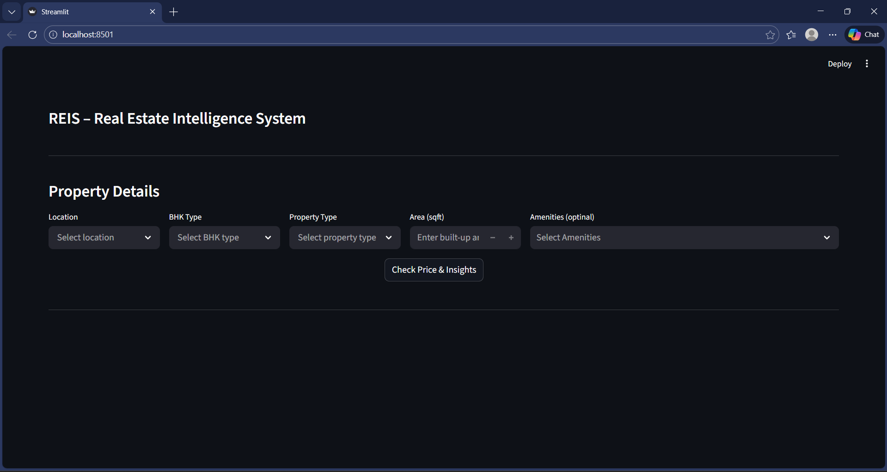
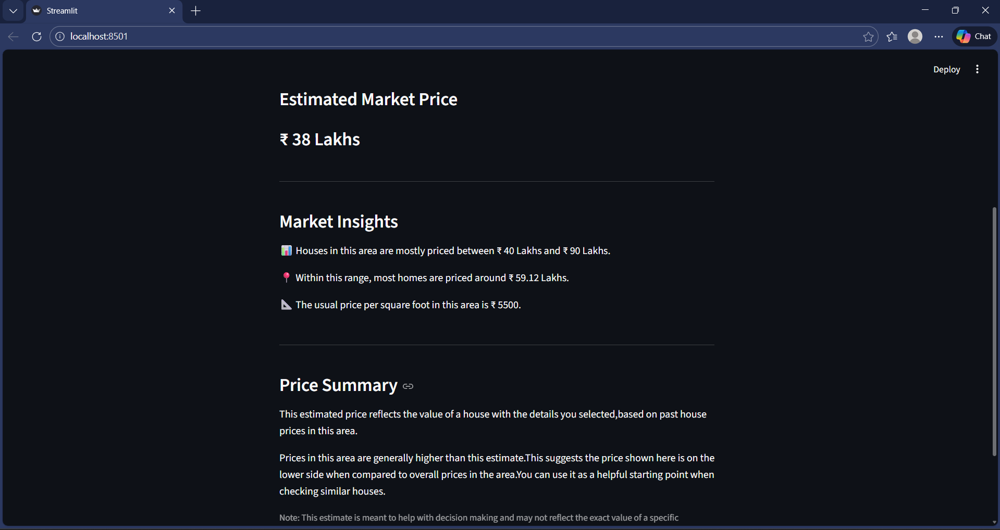

# REIS – Real Estate Intelligence System

## Overview

REIS (Real Estate Intelligence System) is a data science project that implements a simplified reference system for residential property price estimation and area-level market analysis. The project focuses on illustrating core ideas behind price modeling and descriptive market statistics using publicly available data.

REIS is designed as a decision-support and explanatory prototype, emphasizing clear assumptions, reproducible logic, and careful interpretation of results.

---

## Project Objective

The objective of REIS is to present a clear, structured example of an end-to-end data science workflow applied to real estate price estimation. The project highlights data preparation, feature engineering, modeling choices, and the separation of predictive estimates from descriptive market insights.

---

## Data Source

- Dataset sourced from **Kaggle**
- Contains residential property listings **limited to the Chennai region**
- Uses **property price observations**

### Key features available
- Location  
- Built-up area (sqft)  
- Number of bedrooms  
- New vs resale property  
- Amenity availability (binary indicators)

### Important missing details
- House type (apartment vs independent house)  
- Property age  
- Floor number  
- Construction quality  
- Exact distances to amenities  
- Builder or project information  

These limitations directly affect model accuracy and output granularity.

---

## Project Workflow

### 1. Data Cleaning
- Removed duplicate records and filtered out noisy or invalid entries  
- Standardized location names to ensure consistency across records  
- Addressed missing and inconsistent values using appropriate strategies  

### 2. Exploratory Data Analysis
- Identified a strong right skew in property prices  
- Preferred median-based statistics over means for more robust insights  
- Observed that no single feature explains a large share of price variation  

### 3. Feature Engineering
- Grouped infrequent locations into an `"other"` category to reduce sparsity  
- Combined individual amenity indicators into a single aggregated amenity score  
- Produced a frozen, model-ready dataset to ensure consistency during modeling  

### 4. Modeling
- Evaluated multiple regression models to compare baseline performance  
- Selected **Support Vector Regression (SVR)** based on better generalization behavior  
- Modeled the target variable in log space to account for skewed price distributions  

### 5. Insights Generation
- Derived market insights directly from property price observations using descriptive statistics  
- Kept insight computation separate from model predictions to avoid over-interpretation  

---

## Output Explanation

REIS provides:
- A baseline price estimate  
- Area-level insights, including:
  - Typical price range  
  - Median price  
  - Median price per square foot  
- A simple price summary comparing the estimate to area norms  

Because of data and feature limitations:
- Outputs should be treated as **reference points**
- Not as exact valuations or final decisions  

The model is trained on property price observations from a publicly available dataset, so the estimates should be interpreted as reference values rather than confirmed transaction prices.

---

## Application Demo





---

## Model Performance and Limitations

The dataset contains a limited set of explanatory features, which restricts the model’s ability to capture fine-grained price variation. This results in:
- Low variance across models  
- Limited gains from more complex algorithms  
- Stable but not highly precise predictions  

This behavior reflects **data constraints, not modeling errors**.

---

## Project Scope

- REIS illustrates how price estimation and area-level insights can be derived from data.
- The project focuses on core data science concepts, including:
  - problem framing  
  - data preparation  
  - modeling decisions  
  - interpretation of outputs  
- It is designed to clearly demonstrate these ideas and provide contextual understanding of price estimates and market insights.

---

## Project Structure
```
reis/
├── notebooks/
│   ├── data_cleaning.ipynb
│   ├── eda.ipynb
│   ├── feature_engineering.ipynb
│   └── modeling_and_evaluation.ipynb
├── data/
│   ├── raw_chennai_dataset.csv
│   ├── cleaned_chennai_dataset.csv
│   └── final_chennai_dataset.csv
├── artifacts/
│   ├── reis_svr_model.pkl
│   ├── final_feature_columns.json
│   └── location_grouped_values.json
├── app.py              
├── main.py             
├── preprocessing.py
├── insights.py
├── README.md
└── requirements.txt
```
---

## Future Enhancements

REIS can be further improved through the following enhancements:
- Integrate verified transaction-level price data from sources such as government records and institutional datasets to improve reliability and real-world relevance.
- Add time-aware analysis to capture price trends and market changes over time.
- Include richer property attributes (house type, age, floor level) to improve contextual accuracy.
- Compare price growth across locations and development stages.
- Provide confidence ranges to better communicate uncertainty in estimates.